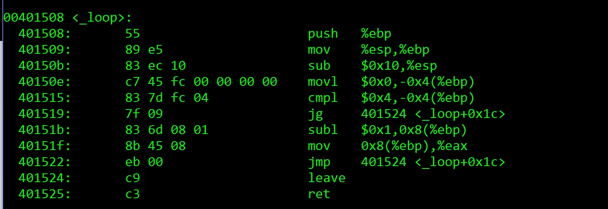

# x86-assembly
A collection of baby C programs designed to be compiled and their .out files fed to the gdb for some assembly inspection

**README IN PROGRESS**

<p align="center">
  
</p>

x86 assembly. Fascinating...also Mind-numbing, sometimes at the same time. I couldn't find the exact resources I was looking for to delve into some simple c-to-assembly and assembly-to-c methods, I decided to create them myself. For all those looking to peruse a little assembly and see if they are on the right track, enjoy this repository. 

## From the Assempractice.c file

### addten function
This function is a simple method designed to add 10 to a variable passed through parameters, and return this variable.
```sh
int addten(int x)
{
    int z = x + 10;
    return z;
}

```
I don't think it gets much simpler than this. Notice how I choose to create a new local variable and then return that variable in two different steps. We will see later through the assembly that this action, while no different than "return x + 10;" to the c code, causes the assembly code to perform two extra data transfers that prove wasteful and inefficent.
